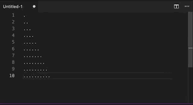
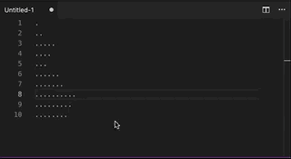

# Flip

Reverse those lines!

## Commands

- `flip.document`: reverse the order of all lines in the document

  

- `flip.selection`: reverse the order of all lines in each selection

  

## Release Notes

Support older versions of VS Code

### 0.0.1

Initial release of Flip.

### 0.0.3

Update dependencies to support new VS Code releases
